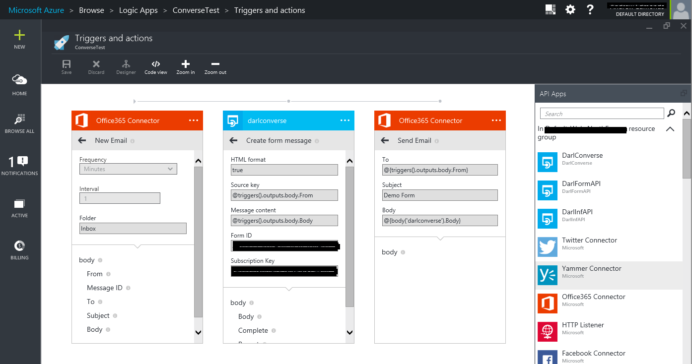
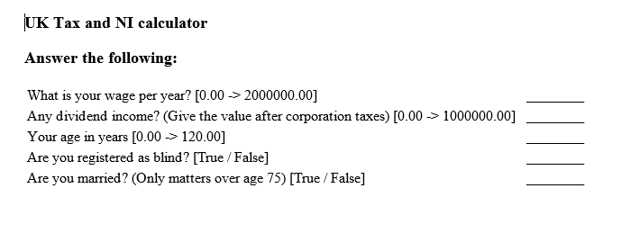
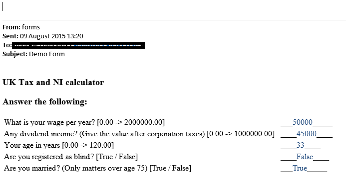
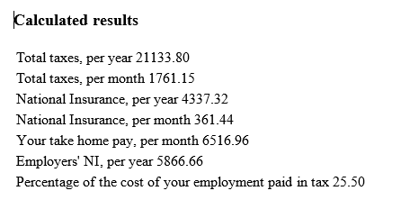

Using Darl Converse
================
This tutorial will show you how to use Darl Converse to create an email converstation with a client.

## Requirements
Please read the [general tutorial](tutorial) first.

#Creating a Logic App
For this example we need three elements, two of which are Office365 connectors and the other is our DarlConverse API app.

Add the elements in the order Office365, Darl Converse, Office365, setting the first to trigger on a new email, the second to use the onllty method, __Create Form Message__and the last to Send Email.
Each of the inputs can be set as shown.

Note that the messages are set to HTML in Darl Converse. The Send Email Office365 needs to be set to send a response in HTML too.

The Office365 elements will need to be authorized. For our example we set up an account called forms@docandys.com just for this example. 
The example rule set chosen calculates the UK tax take for a particular income. 

## An example run

Sending an email to the selected account triggers the Logic App, which then calls DarlConverse with the body.
Our initial email contained only a general signature.

Darl Converse starts a new session with the source email address as the key, and creates a question set body to send as a response to the message. 

Respond to the email by editing the text on the dotted lines.

Sending the email back will trigger the Logic App again. This time a cached session exists with the sending email as the key.

Darl Converse reads the email contents, looking for ids embedded in the original html and reads the values.

The response email is generated by the Darl Forms back end and converted to email compatible HTML.

# Possible additions to the logic app

This example has the usagemapId, identifying the rule set project to run, hard wired. One might easily get this from the subject of the incoming email. It is only required at the start of the session and cached thereafter.
Some extra programming using the [CsScripting API app](https://github.com/logicappsio/CsScriptingAPI) could add the ability to send simple friendly names in the subject and map these to the project ids, which are nor particularly friendly.

All the data generated by this conversation can be used for for further processing. Another App could be arranged to be dependant on Darl Converse, taking either the __Report__, which contains formatted results, or the list of name-value pairs in the __Values__.
Rather than calling this every time data is exchanged, you could add the condition that the Darl Converse output __Complete__ be true, which occurs only at the end of the conversation when all data and results/inferences have been generated.

# Using the app with the Twitter connector, Twilio, etc.

This App also functions with text based media like twitter. Since multiple questions are unlikely to fit into the character limits, these are best set to be run one question at a time.
To achieve this set the number of questions to 1 in the [Form editor](formeditor).
Set the Darl Converse HTML Format input to _False_. In this case Darl Converse will look for a single item in the response tweet, text or whatever and attempt to convert it to the required format.
If the conversion fails the same question will be resent.