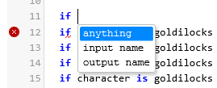
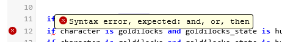

The Darl Editor
====

## Other pages

+ [The index](index)
+ [Fuzzy sets](fuzzysets)
+ [Project page](projectpage)
+ [The Darl language](darl)
+ [Testing a Darl rule set](darltest)
+ [Editing the format of Darl Forms](formeditor)
+ [Editing the text of Darl forms](languageeditor)
+ [Testing a Darl form](formtest)
+ [A complete tutorial](tutorial)
+ [Darl Converse tutorial](conversetutorial)

The Darl editor is an on-line editor especially adapted for the Darl language.
It contains a linter that checks the text you give for grammar errors as you type and a suggestion engine that offers the appropriate Darl keywords.

As you type suggested text is created, and the location of any grammar errors are indicated by the red icon to the left, and a red underline beneath the location of the first error.

The linter uses the same compiler as the runtime processor, so a Darl file without errors will be grammatically correct.

 
By hovering over the underlined text you can see the details of the error.

You can freely copy text into and out of the editor.

Selecting "Save Changes" will save the most recent copy of the text and return you to the project list page, whereas "Back to List" will do the same without saving changes.

