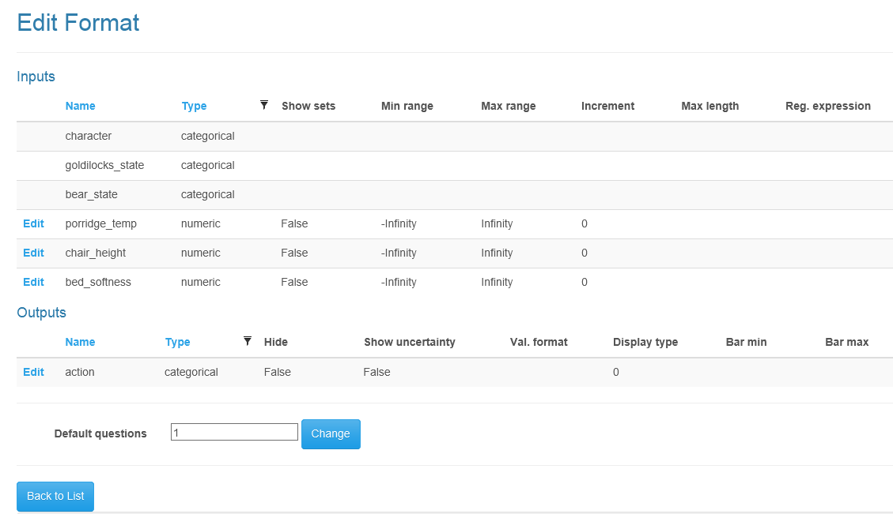
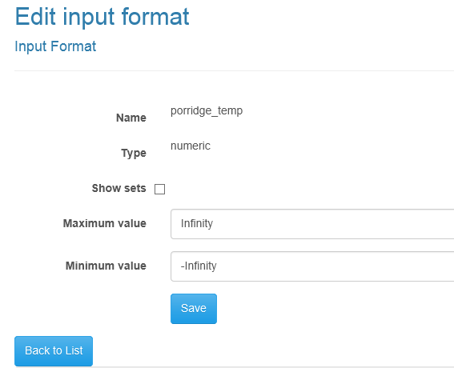
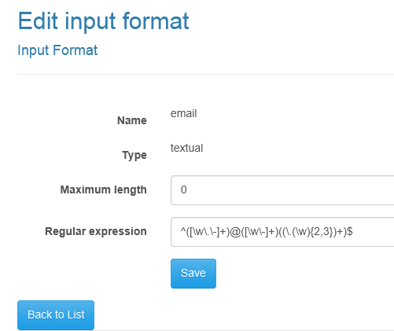
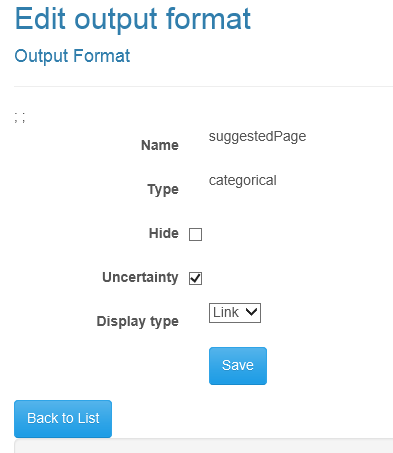
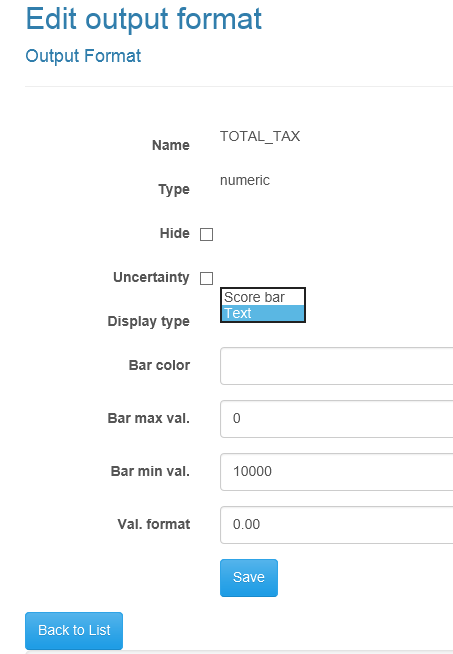

Form Editor
=====

## Other pages

+ [The index](index)
+ [Fuzzy sets](fuzzysets)
+ [Project page](projectpage)
+ [The Darl on-line editor](darleditor)
+ [Testing a Darl rule set](darltest)
+ [The Darl language](darl)
+ [Editing the text of Darl forms](languageeditor)
+ [Testing a Darl form](formtest)
+ [A complete tutorial](tutorial)
+ [Darl Converse tutorial](conversetutorial)

There are several aspects of the display of forms that can be modified using this editor.
The page shows lists of the inputs and outputs and permits the user to choose the default number of questions to be shown at a time.

Every time you save the Darl code the associated Format and text files are updates to reflect any changes in the inputs or outputs.

Not all I/O and type combinations are editable. Categorical inputs are always displayed as drop down selections, but numeric and textual inputs as well as all output types have editable attributes.

# Numeric inputs

There are two display possibilities with numeric inputs.

## Text box with range

If "Show sets" is not selected a text box with range checking will be displayed to the user of the questionnaire.
The initial values shown are derived from the range of the variable in any fuzzy sets defined. Change these to practical vales.
A warning message will be shown if the user puts in a non-numeric value, or one outside these bounds.

## Drop down list with set names

Sometimes, as in asking end-users about their impressions of something, fuzzy terminology is more useful than a numeric value.
If you select "Show sets" the set names - or text values you choose to override them in the text page - will be displayed in a drop down box.
When the runtime processor evaluates such inputs it replaces the value put into the system with the set definition interpreted as a fuzzy number.

# Textual inputs

Textual inputs are always displayed as text edit boxes. 

You can set two constraints: the maximum length in characters (0 is treated as no constraint) and a regular expression limiting the input format.
The example shows a regular expression accepting only valid email addresses.

# Outputs

The inferred results of a form can be shown to the end user at the completion of a form, or hidden. Furthermore, since we use a fuzzy logic inference engine to create the results, we can just return the central or dominant result, or supply uncertainty information.
both kinds of outputs have _Hide_ and _Uncertainty_ select boxes to decide if the output is shown to the end user and if the uncertainty information should be displayed.

## Categorical outputs

The only modifiable property other than hidden and uncertainty is whether the result is displayed in the form of a link or as simple text. The text and link format can be set using the text page.

##Numeric outputs

Numeric outputs can be displayed either as text or as score bars. 
Use the Display Type to select one or other.
If Score bar is selected the inputs Bar color, Bar max val and Bar Min val are used to format the score bar.

+ Bar color requires a standard RGB value in the format #RRGGBBYY.
+ Bar min val requires a numeric value used to determine the minimum value of the bar.
+ Bar max val requires a numeric value used to determine the minimum value of the bar.

if Text is selected as the display type a simple textual output is created, formatted according to the format given. 

