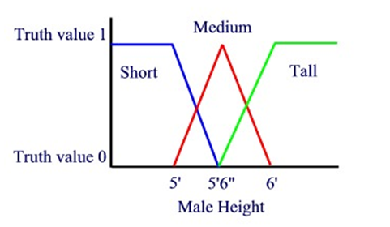

Fuzzy logic and sets
====


In classical, Boolean logic one can reason with sets, where set membership is clearly defined. 
For instance, you are either a member of your local gym, or you are not. 
One can also reason with numeric variables by using bounds, such as > x, < y, etc.

In Fuzzy logic parlance, such sets and limits are called "crisp". This means that membership is sharply defined.

Around 500BC, the Greek philosopher Zeno described a paradox, known as the sorites paradox, that illustrates the problem with crisp sets:

+ A pile of 2 or 3 stones is a small pile of stones
+ If you add a stone to a small pile of stones, it is still a small pile of stones
+ Therefore all piles of stones are small.

There are several conclusions we can draw from this paradox.

+ Qualitative words like "small" "medium", "large", "high", "low", etc.don't map well onto crisp sets.
+ It seems that it can be possible to both partly in and partly out of a set.
+ As more  stones are added, the statement "this is a small pile of stones" becomes less true, so truth can be partial.

You can only show that the third line is untrue, and so break the paradox, if you accept that the truth of the statement "this is a small pile of stones" decreases with more stones added; so you must accept that truth can be somewhere between absolute truth, and absolute falsehood.

Fuzzy logic is a system of logic that represents truth as a real number between 0 and 1 inclusive. 
0 represents absolute falsehood, 1, absolute truth.

The degree of truth of a statement may be anywhere between 0 and 1. 

This requires a redefinition of the idea of a set. Fuzzy sets are defined as sets that can an object or state can be a partial member of, i.e. a statement referring to set membership may have partial truth.

The principal use of this idea is for numeric variables, like the number of stones in a pile.

The standard way of representing fuzzy sets is as a chart with the Y axis representing the degree of truth, so 0-1, and the X axis representing the domain of the variable.

So, for instance, if we were to try to describe European male height we might create the following sets:



There is no reason why a variety of shapes might not be used for fuzzy sets; the only requirement is that they are convex.
However we have chosen for Darl a simple set of definitions that are very easy to describe.


These sets can be described just using an ascending-ordered sequence of numbers representing the intercepts of a vertical line dropped from the vertices to the X axis.

so, the sequence 1,2, represents a range between 1 and 2 inclusive, 1,2,3 represents a triangular fuzzy set peaking at 2, and 4,5,6,7 describes a trapezoid fuzzy set.

#Unbounded sets

Some set definitions are unbounded on the left or right. In the case of male height above, the outer sets are unbounded.
This is achieved with Darl by using the two keywords _-Infinity_, and _Infinity_. 
So, using decimal feet rather than feet and inches, the definition of _Short_ would be ```-Infinity, 5, 5.5```.


