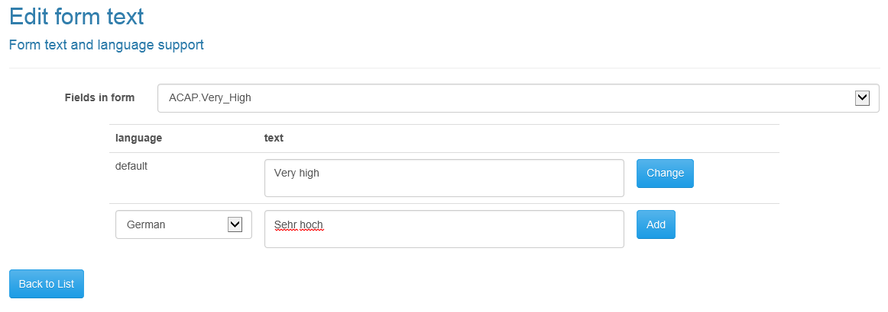

Form text editor
======

All the text values shown to the user are editable and can be displayed in a variety of languages.
The text editor enables you to set these values and the language variants displayed based on the end-users browser language preferences.
The initial values given are the names used in the Darl code.

# Category and set names

You can override the values shown in drop down boxes.
The initial values of these are the values given in the Darl code, and they are identified using the name of the input or output, a "." and the name of the category or set.

The above illustrates how to edit the displayed text.

The _Fields in form_ drop down holds the names of all the editable fields in the form.
The default language is the English text.
The language drop down contains all the two letter ISO languages.

#General formatting inputs

All forms are supplied with three general text fields, which will be displayed as headers in the questionnaire.

+ _Format.preamble_ is displayed at the top of the questionnaire.
+ _Format.questionHeader_ is displayed above each set of questions.
+ _Format.resultHeader_ is displayed above the results.