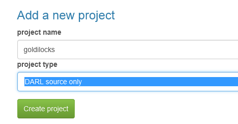
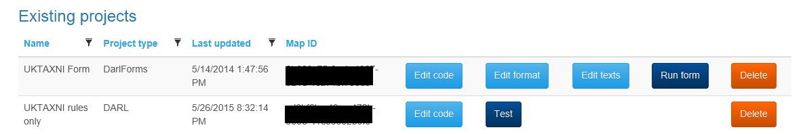

Project page
=========

## Other pages

+ [The index](index)
+ [Fuzzy sets](fuzzysets)
+ [The Darl language](darl)
+ [The Darl on-line editor](darleditor)
+ [Testing a Darl rule set](darltest)
+ [Editing the format of Darl Forms](formeditor)
+ [Editing the text of Darl forms](languageeditor)
+ [Testing a Darl form](formtest)
+ [A complete tutorial](tutorial)
+ [Darl Converse tutorial](conversetutorial)

The project page is accessible via the main menu under the _Editing_ tab.
It contains a section where you can add a new project with a choice of two types (Several more will be added in the near future.).

The project list shows a paged and sortable subset of your projects. 
Depending on the type various actions are available to permit editing and testing of your projects.

Columns are sortable and filterable. The Map ID column contains the id of that project, which is used with the API app to set the project.