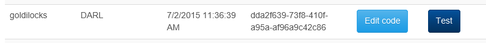
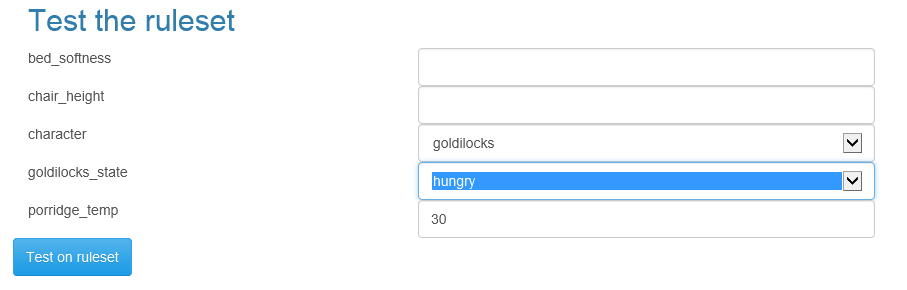
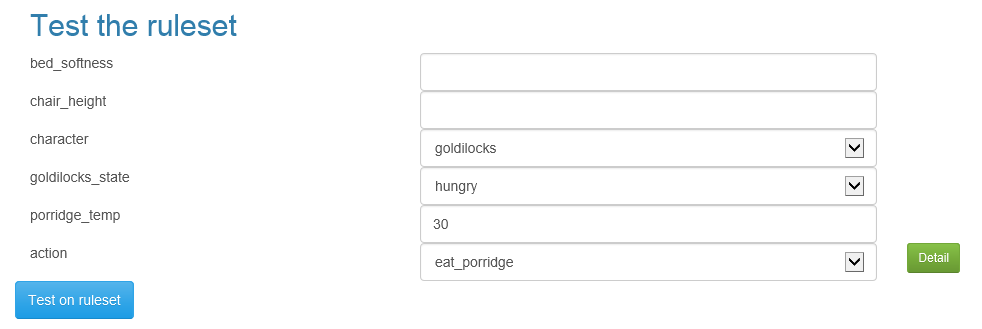
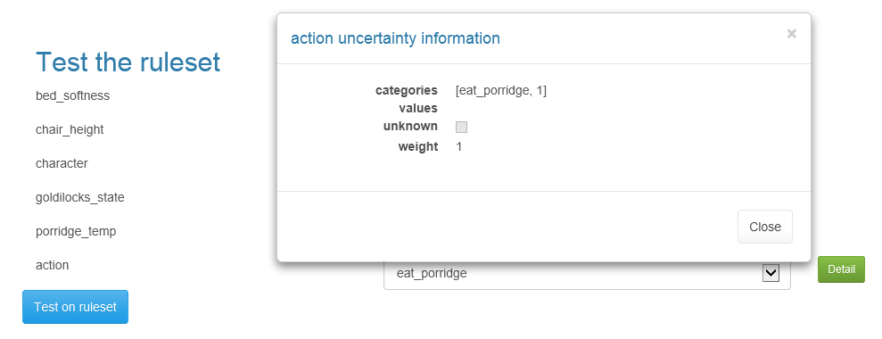
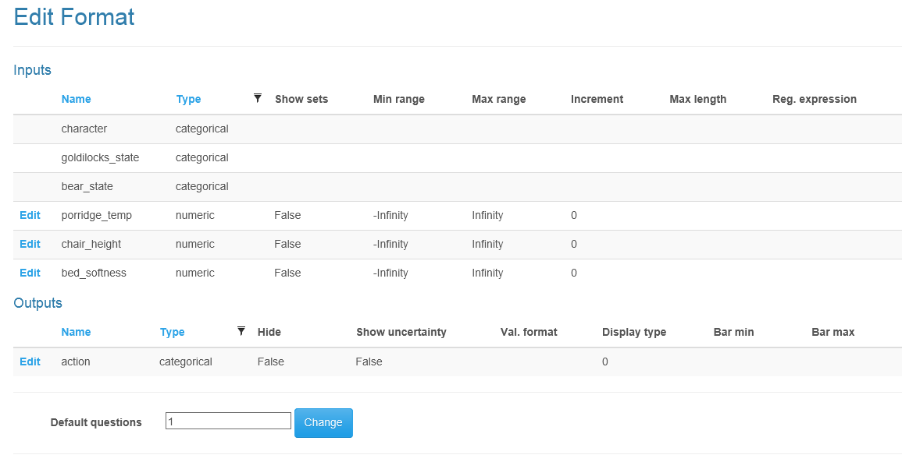
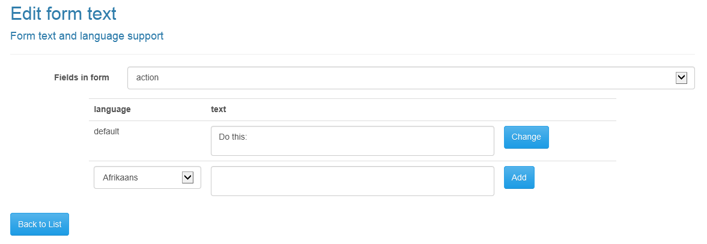
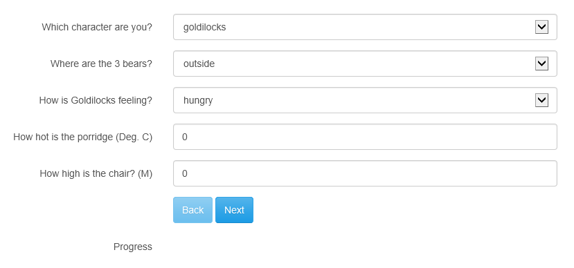
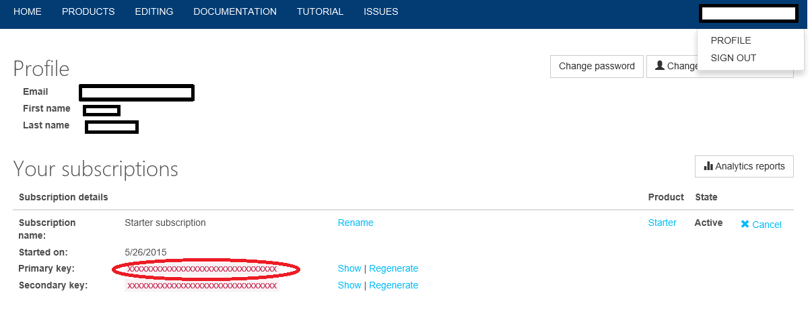
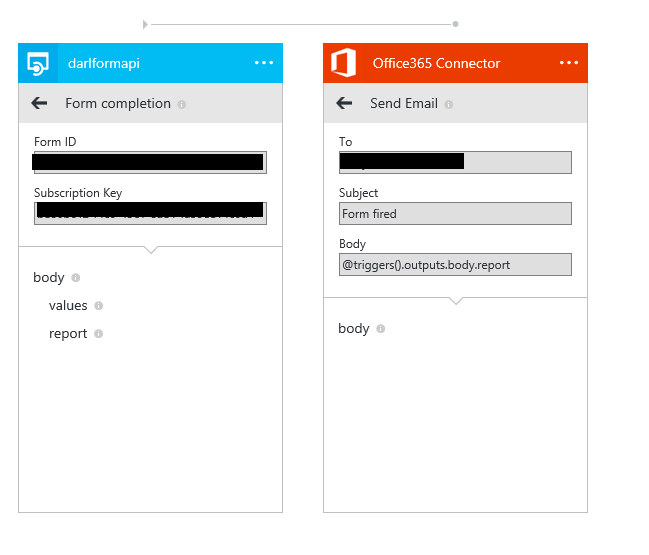
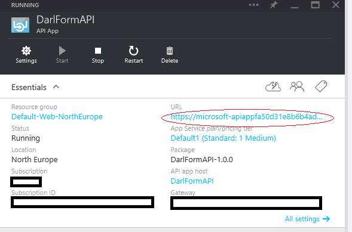

An end to end tutorial
============
This tutorial will show you first how to create a Darl file for a simple logical inference task, and then go on to show you how to use this with the Api apps, by adding project types and supporting documents.
After you've read this you can view the [Darl Converse tutorial](conversetutorial) which relies on this tutorial.

# Example inference task
To choose something simple and general let's pick a nursery story that everyone in the English speaking world will have come across, the story of [Goldilocks and the three bears](http://www.dltk-teach.com/rhymes/goldilocks_story.htm).
Trivial as this story might seem, to model the actions of the characters we need both numeric and categorical values. 
The story contains fuzzy linguistic variables like "too hot", "too cold", "too big", etc. so we can make use of fuzzy sets.

# Creating a project 
Setting up a Darl or DarlForms app takes place on two sites, the [Azure portal](https://portal.azure.com) and [this site](https://darlinf.portal.azure-api.net/).
Go to the latter first, and register for a new account, or sign in if you have already.

Then go to the "Editing" menu item and create a new project by making the following changes:


Select "Create Project".

The resulting project will appear in the list below.



Note that your Map ID will be different from the above. This is the ID that identifies the project and all its elements to the API apps.

Now click on the "Edit Code" button and the [Darl edit](darleditor) window will appear.


Change the name of the ruleset from "ruleset1" to "goldilocks".

The first thing to do is to determine what the inputs and outputs are. 
The rule set will direct the characters of the story, so we need to have a list of them. 
So the first thing to do is to create a character input. This contains an array of choices, so is a categorical input. You use these for anything with categories.
```darl
ruleset goldilocks
{
  input categorical character {goldilocks, mama_bear, papa_bear, baby_bear};
}
```
Notice that at each stage of editing the editor suggests completion choices, and the left margin contains a red mark to indicate grammar errors. If you hover over the error icon you will see a description of the error.
Note that, like "C" the lines end in semicolons. Names should also obey the "C" rules for names, so no spaces, and can't start with a number.'

The main character has three states, hungry, tired and sleepy. Let's add a categorical input for that.
```darl
ruleset goldilocks
{
  input categorical character {goldilocks, mama_bear, papa_bear, baby_bear};
  input categorical goldilocks_state {hungry,tired,sleepy};
}
```
Now, in the story there is porridge that is too hot, too cold, and just right. Let's construct an input for that.

```darl
ruleset goldilocks
{
  input categorical character {goldilocks, mama_bear, papa_bear, baby_bear};
  input categorical goldilocks_state {hungry,tired,sleepy};
  input numeric porridge_temp {{too_cold,-Infinity,20,30},{just_right,20,30,40},{too_hot,30,40,Infinity}};
}
```
You can read more about [fuzzy sets here](fuzzysets) but this describes three fuzzy sets for the input porridge_temp. 
The example uses metric units throughout, so we're saying that we have a fuzzy set stretching from -infinity to 20 degrees C with degree of truth 1, dropping to degree of truth 0 at 30 for too cold.
Just_right is a triangular set going from 20C, peaking at 30C, and returning to zero truth at 40C. 
Too_hot starts at 30c, raises to 40c for degree of truth 1 and stays there to +infinity.
Note that Infinity is case sensitive, and also that, by convention, the sets overlap so that the sum of the degrees of truth add up to one across the domain of the variable.

Let's add similar inputs for chair height, in meters, and bed softness. (The latter holding the Young's modulus of the material. ).

```darl
ruleset goldilocks
{
  input categorical character {goldilocks, mama_bear, papa_bear, baby_bear};
  input categorical goldilocks_state {hungry,tired,sleepy};
  input numeric porridge_temp {{too_cold,-Infinity,20,30},{just_right,20,30,40},{too_hot,30,40,Infinity}};
  input numeric chair_height {{too_low,-Infinity,0.2,0.3},{just_right,0.2,0.3,0.4},{too_high,0.3,0.4,0.5},{much_too_high,0.4,0.5,Infinity}};
  input numeric bed_softness {{too_hard,-Infinity, 90,100},{just_right,90,100,110},{too_soft,100,110,Infinity}};                            
}
```

So now we need at least one output. Let's make it a set of directions as to what to do next. Let's start with Goldilocks, and we'll look at the bears later.

```darl
ruleset goldilocks
{
  input categorical character {goldilocks, mama_bear, papa_bear, baby_bear};
  input categorical goldilocks_state {hungry,tired,sleepy};
  input numeric porridge_temp {{too_cold,-Infinity,20,30},{just_right,20,30,40},{too_hot,30,40,Infinity}};
  input numeric chair_height {{too_low,-Infinity,0.2,0.3},{just_right,0.2,0.3,0.4},{too_high,0.3,0.4,0.5},{much_too_high,0.4,0.5,Infinity}};
  input numeric bed_softness {{too_hard,-Infinity, 90,100},{just_right,90,100,110},{too_soft,100,110,Infinity}};        
  output categorical action {try_another_porridge, try_another_chair, break_chair, try_another_bed, go_to_sleep};
}
```

Now we have inputs and outputs we need some rules:

```darl
ruleset goldilocks
{
  input categorical character {goldilocks, mama_bear, papa_bear, baby_bear};
  input categorical goldilocks_state {hungry,tired,sleepy};
  input numeric porridge_temp {{too_cold,-Infinity,20,30},{just_right,20,30,40},{too_hot,30,40,Infinity}};
  input numeric chair_height {{too_low,-Infinity,0.2,0.3},{just_right,0.2,0.3,0.4},{too_high,0.3,0.4,0.5},{much_too_high,0.4,0.5,Infinity}};
  input numeric bed_softness {{too_hard,-Infinity, 90,100},{just_right,90,100,110},{too_soft,100,110,Infinity}};        
  output categorical action {try_another_porridge, eat_porridge, try_another_chair, break_chair, try_another_bed, go_to_sleep};
  
  if character is goldilocks and goldilocks_state is hungry and porridge_temp is just_right then action will be eat_porridge;
  if character is goldilocks and goldilocks_state is hungry and not porridge_temp is just_right then action will be try_another_porridge;
  if character is goldilocks and goldilocks_state is tired and chair_height is just_right then action will be break_chair;
  if character is goldilocks and goldilocks_state is tired and not chair_height is just_right then action will be try_another_chair;
  if character is goldilocks and goldilocks_state is sleepy and bed_softness is just_right then action will be go_to_sleep;
  if character is goldilocks and goldilocks_state is sleepy and not bed_softness is just_right then action will be try_another_bed;
}

```

Hopefully these are reasonably clear without too much explanation. 
Each rule starts with "if", is followed by a bunch of conditions, the word "then", an output name, "will be" and the new state of the output if the rule fires.
The conditions use the logical operators "and", "or" and "not". There is also another operator "anything", which makes a rule always succeed.
"is" is used to test inputs or outputs used as inputs (this is possible, so long as you don't make loops).
The left side of an "is"  holds the input or output name, the right side whatever you want to test against. If it's a categorical input or output one of the defined categories can be used, if numeric either a set name or an arithmetic expression.

If you've got a complete ruleset with no compilation errors then you can test it.
Save the edited ruleset and choose "Test" from the "existing projects" table.



Change the selections to look like the above and select "Test on ruleset".



The action will be as above if you've types in the ruleset properly.

The "Detail" button brings up a pop up window containing uncertainty information:



Now close the pop up and switch "goldilocks_state" to "tired" and test again. 
This time the result is empty, because we don't have a value for "chair_height", and the pop up will show the following:


 
The rules for the other characters can be added easily. Note that there's a new input "bear_state", and the list of actions have been extended. The categories are shorthand for "who's been sleeping in my bed?" etc..

```darl
ruleset goldilocks
{
  input categorical character {goldilocks, mama_bear, papa_bear, baby_bear};
  input categorical goldilocks_state {hungry,tired,sleepy};
  input categorical bear_state {outside,livingroom,bedroom};
  input numeric porridge_temp {{too_cold,-Infinity,20,30},{just_right,20,30,40},{too_hot,30,40,Infinity}};
  input numeric chair_height {{too_low,-Infinity,0.2,0.3},{just_right,0.2,0.3,0.4},{too_high,0.3,0.4,0.5},{much_too_high,0.4,0.5,Infinity}};
  input numeric bed_softness {{too_hard,-Infinity, 90,100},{just_right,90,100,110},{too_soft,100,110,Infinity}};        
  output categorical action {try_another_porridge, eat_porridge, try_another_chair, break_chair, try_another_bed, go_to_sleep, say_WBEMP, say_WBEMPA, say_WBSIMC, sayWBSIMCB, say_WBSIMB, say_WBSIMBST};
  
  if character is goldilocks and goldilocks_state is hungry and porridge_temp is just_right then action will be eat_porridge;
  if character is goldilocks and goldilocks_state is hungry and not porridge_temp is just_right then action will be try_another_porridge;
  if character is goldilocks and goldilocks_state is tired and chair_height is just_right then action will be break_chair;
  if character is goldilocks and goldilocks_state is tired and not chair_height is just_right then action will be try_another_chair;
  if character is goldilocks and goldilocks_state is sleepy and bed_softness is just_right then action will be go_to_sleep;
  if character is goldilocks and goldilocks_state is sleepy and not bed_softness is just_right then action will be try_another_bed;
  if character is baby_bear and bear_state is outside then action will be say_WBEMPA;
  if character is baby_bear and bear_state is livingroom then action will be say_WBSIMCB;
  if character is baby_bear and bear_state is bedroom then action will be say_WBSIMBST;
  if character is mama_bear and bear_state is outside then action will be say_WBEMP;
  if character is mama_bear and bear_state is livingroom then action will be say_WBSIMC;
  if character is mama_bear and bear_state is bedroom then action will be say_WBSIMB;
  if character is papa_bear and bear_state is outside then action will be say_WBEMP;
  if character is papa_bear and bear_state is livingroom then action will be say_WBSIMC;
  if character is papa_bear and bear_state is bedroom then action will be say_WBSIMB;
}
```

# Creating a form

Create a new project of the type "Darl form" called "goldilocks form" and copy and paste the previous rule set into the code editor for that form and save the changes.

Saving the code automatically updates the Format and language specifications with the inputs and outputs.
If you click on the "Edit Format" button in the project list beside the project you should see this:



The "Edit Format" page allows you to change the display format of the various inputs and outputs. For instance, for numeric inputs you can select "show sets" in which case in the final questionnaire the UI will display a drop down with the set names, rather than require a numeric input.
For outputs you can change the way the data is displayed. Numeric outputs can be displayed as bars or as formatted numbers.

We don't need to change anything here.

Now go to the "Edit Texts" page.



This enables you to set the text associated with each question. 
The top drop down contains every field that can have text associated. 

Note that as well as the default text, which is in English, you can set language variants in any language.

For each text defaults are provided, but in most cases you will want to replace them, especially for other languages.


There are lots of texts to change, but the following is a list of suggested texts.

Name | Text
-------- | -----------------------
character | Which character are you?
character.goldilocks | Goldilocks
character.mama_bear | Mama bear
character.papa_bear | Papa bear
character.baby_bear | baby bear
goldilocks_state | How is Goldilocks feeling?
goldilocks_state.hungry | hungry
goldilocks_state.tired | tired
goldilocks_state.sleepy | sleepy
bear_state | Where are the 3 bears?
bear_state.outside | outside of the house
bear_state.livingroom | In the living room
bear_state.bedroom | In the bedroom
porridge_temp | How hot is the porridge (Deg. C)
chair_height | How high is the chair? (M)
bed_softness | How soft is the bed?
action | Do this:
action.try_another_porridge | try another porridge
action.eat_porridge | eat porridge
action.try_another_chair | try another chair
action.break_chair | break chair
action.try_another_bed | try another bed
action.go_to_sleep | go to sleep
action.say_WBEMP | Say "Who's been eating my porridge?"
action.say_WBEMPA | Say "Who's been eating my porridge? And it's all gone!"
action.say_WBSIMC | Say "Who's been sitting in my chair?"
action.sayWBSIMCB | Say "Who's been sitting in my chair? And they've broken it!"
action.say_WBSIMB | Say "Who's been sleeping in my bed?"
action.say_WBSIMBST | Say "Who's been sleeping in my bed? And they're still there!"
Format.preamble | 
Format.questionHeader | 
Format.resultHeader | 

## Testing the questionnaire

To test the questionnaire choose test in the projects list  



# Using the results in a Logic App

We've built a form from scratch, complete with logic, text and formatting. Now we need to use it with a Logic App.

This is quite straightforward, though at the time of writing Logic Apps are not finalized and some details may change.

The two key pieces of information you need are the project Map ID, available in the projects list, and one of your keys available by clicking on your name in the log in and selecting Profile.




## Wiring up a Darl Form in a Logic App

Add a darlformapi to the logic app surface by clicking on the instance in the resource group set of API apps. 
Add the Map ID and subscription key from above.
Then add an Office 365 Connector. (This assumes you have an Office 365 account)
When you instantiate the connector you will associate it with your account.

Set the "to address" to your email, and set the subject to "Form fired".
Finally link the body to a formatted version of the results from the darlformapi app, available in the report section of the outputs.

by typing
```
@triggers().outputs.body.report
```

This sets the logic app to respond to a push trigger from the app whenever a form is completed, and to email the formatted results to you.

__Note__ that at the time of writing, push triggers are only updated hourly within Azure, so you may have to wait until this starts to work. Until the trigger is loaded the web page will show an error.



The final question is the address of the form. This is found in the settings of the Darl form API app.



I hope this all makes sense. Please report any issues through the [portal issues page](https://darlinf.portal.azure-api.net/issues).

[Darl Converse tutorial](conversetutorial) 
